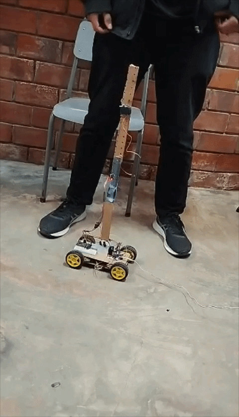

# Inverted Pendulum on a Cart

Real-time balancing of an inverted pendulum using an ESP32, MPU6050 IMU, and a PID motor controller.

## Demo

## What this project does

- Reads pendulum angle from MPU6050 (accelerometer + gyro fusion).
- Estimates tilt with a complementary filter.
- Runs a PID loop to command motor drive in normalized range `[-1, 1]`.
- Adds safety logic (fall cutoff + upright deadband reset).

## Theory

The cart-pole (inverted pendulum on a cart) is an underactuated and unstable system. Without feedback, the upright equilibrium falls.

Using the standard point-mass cart-pole model (from Lagrangian mechanics), with cart position $x$, pole angle $\theta$, cart force $f_x$, cart mass $m_c$, pole mass $m_p$, and pole length $l$:

$$
(m_c + m_p)\ddot{x} + m_p l\ddot{\theta}\cos\theta - m_p l\dot{\theta}^2\sin\theta = f_x
$$

$$
l\ddot{\theta} + \ddot{x}\cos\theta + g\sin\theta = 0
$$

In this convention, $\theta = 0$ is hanging down, so upright is $\theta = \pi$. Linearizing around upright with $\phi = \theta - \pi$ and $|\phi| \ll 1$ gives:

$$
(m_c + m_p)\ddot{x} - m_p l\ddot{\phi} = f_x
$$

$$
l\ddot{\phi} - \ddot{x} - g\phi = 0
$$

If the cart is fixed ($\ddot{x} = 0$), then:

$$
\ddot{\phi} \approx \frac{g}{l}\phi
$$

So a small tilt grows with time, which is exactly why active feedback is required.

This firmware uses local stabilization around upright via PID on the estimated angle. It is not a swing-up controller.

## Control pipeline in this code

1. `pendulumAngleWork(...)` in `src/mpu.cpp` returns filtered angle in degrees.
2. `pidUpdate(...)` in `src/pid.cpp` computes motor command from angle error.
3. `motorSetNormalized(...)` in `src/motor.cpp` applies signed PWM to H-bridge pins.
4. Safety behavior in `src/main.ino`:
	 - motor cutoff and PID reset if angle exceeds `45 deg`
	 - zero-hold deadband around upright (`+-0.5 deg`)

## Hardware and firmware notes

- Target MCU: ESP32 (uses `ledcAttach`/`ledcWrite` PWM APIs).
- IMU: MPU6050 over I2C (default SDA `21`, SCL `22`).
- Motor outputs are currently mapped in `src/motor.cpp` to pins `14, 12, 27, 26`.

## Quick start

1. Wire ESP32, MPU6050, motor driver, and motors.
2. Confirm motor pins and polarity in `src/motor.cpp` and `src/main.ino`.
3. Tune PID gains in `pidInit(...)` inside `src/main.ino`.
4. Upload and monitor serial telemetry at `115200` baud.
5. Start with the cart lifted/safe, then test on track.

## Sources

- Russ Tedrake, *Underactuated Robotics*, Chapter 3 (Acrobots, Cart-Poles, and Quadrotors):
	https://underactuated.mit.edu/acrobot.html
- K. J. Astrom and R. M. Murray, *Feedback Systems* (free online control text):
	https://fbsbook.org/
- Inverted pendulum overview and alternate derivations:
	https://en.wikipedia.org/wiki/Inverted_pendulum
